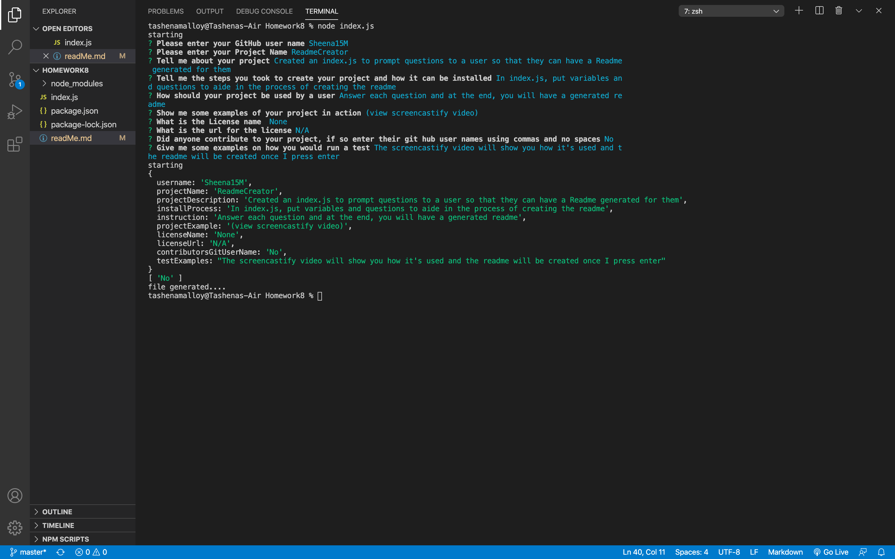

# ReadMeCreator 
Answer questions to create a Readme on a GitHub repo

* [Installation](#Installation)

* [Instructions](#Instructions)

* [License](#License)

* [Contributors](#Contributors)

* [Author](#Author)

* [TestExamples](#TestExamples)
## Installation
Made an index.js file, created questions for the user to answer, installed inquirer and axios via terminal
## Instructions
Answer each question in detail to have a Readme created for you
```
 and Screencastify video (https://drive.google.com/file/d/1ewVmmzrJmXPlDpcXyzvE6_m8QpXXw6GR/view)
```
## License 
This project is licensed under the N/A - see the N/A file for details
## Contributors
undefined
            
  No  GitHubLink: https://github.com/no
## TestnodeExamples
Ran various tests in terminal to ensure functionality
## Author 


**Sheena15M**

Email: null

Location:Union

GitHub: https://github.com/Sheena15M
